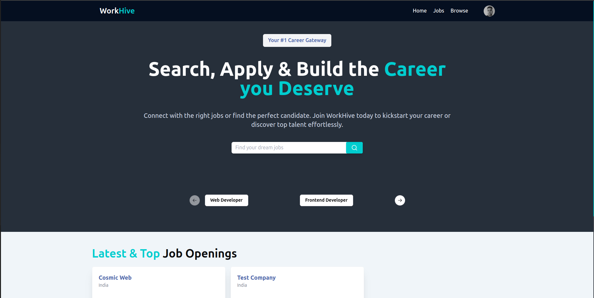

# WorkHive

## Description

WorkHive is a platform where users can create two types of accounts: Students and Recruiters.

- Recruiters can post job opportunities, manage applicants, and review their profiles.

- Students can browse available jobs, apply to positions, and manage their applications through the platform.

This system streamlines the process of job searching for students and simplifies job posting and recruitment for companies.

### [Access the BackEnd Here on GitHub](https://github.com/Sahil2k07/WorkHive-NestJS.git)

## Tech Used

- **Tailwind CSS**: A utility-first CSS framework for efficient and responsive design.
- **TypeScript**: A strongly typed JavaScript superset providing enhanced code safety and developer tooling.
- **React JS**: A popular JavaScript library for building user interfaces.
- **Vite**: A fast and lightweight build tool for modern web development.
- **shadcn**: A utility component library for building UI elements in React and Next.js.

### Home



### Profile


### Jobs


### Applicants


### Mobile UI

<div style="display: flex; gap: 10px;">
    
    
</div>

## Set-up the project locally after setting up the Back-End.

### NodeJS

1. Clone the repository to your local machine.

   ```bash
   git clone https://github.com/Sahil2k07/WorkHive.git
   ```

2. Navigate to the Project Directory.

   ```bash
   cd WorkHive
   ```

3. Set Up your `.env` variable. A `.env.example` is given for your reference.

   ```dotenv
   VITE_SERVER_URL="http://localhost:3000"
   ```

4. Install all the dependencies.

   ```bash
   npm install
   ```

5. Run the command to start the Project in Development Mode.

   ```bash
   npm run dev
   ```

6. Run the command to build the Production version of the Project:

   ```bash
   npm run build
   ```

7. Run the command to run the production build.

   ```bash
   npm run preview
   ```

### Docker

1. Ensure that you have set up the BackEnd First.

   #### [Access the BackEnd Here on GitHub](https://github.com/Sahil2k07/WorkHive-NestJS.git)

2. Clone the repository to your local machine:

   ```bash
   git clone https://github.com/Sahil2k07/WorkHive.git
   ```

3. Navigate to the Project Directory:

   ```bash
   cd WorkHive
   ```

4. Use the following command to Build the Docker image:

   ```bash
   docker build -t workhive_client .
   ```

5. Start the container using the command:

   - Running interactively:

     ```bash
     docker run -p 4173:4173 workhive_client
     ```

   - Running in detached mode:

     ```bash
     docker run -p 4173:4173 -d workhive_client
     ```

6. You will be able to access the website on `http://localhost:4173` of your machine.
